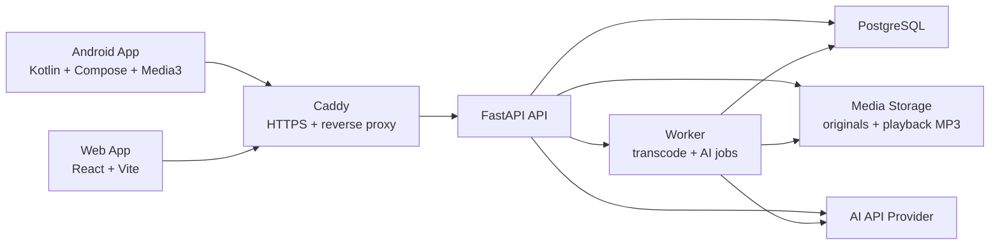

# Easy Music Architecture

## 1. Overview

Easy Music is a self-hosted personal cloud music system.

The first version contains:

- FastAPI backend
- React/Vite web app
- Android app built with Kotlin, Jetpack Compose, and Media3
- PostgreSQL database
- FFmpeg-based media processing
- Worker for background jobs
- Local disk media storage
- Caddy reverse proxy and HTTPS
- Docker Compose deployment

## 2. High-Level Architecture

## 3. Deployment

Target environment:

- Ubuntu physical machine
- Public IP
- Domain name
- 4 TB disk
- Docker Compose

Recommended services:

- `caddy`: HTTPS reverse proxy
- `api`: FastAPI backend
- `worker`: background processing
- `web`: built React web app served by Caddy or a static container
- `postgres`: PostgreSQL database

Recommended mounted paths:

- `/srv/easy-music/media/originals`
- `/srv/easy-music/media/playback`
- `/srv/easy-music/media/covers`
- `/srv/easy-music/postgres`

## 4. Backend

### 4.1 Technology

- Python
- FastAPI
- SQLAlchemy or SQLModel
- Alembic migrations
- PostgreSQL
- FFmpeg
- AI provider abstraction

### 4.2 Core Backend Modules

- Auth
- Users
- Tracks
- Uploads
- Media processing
- Tags
- Playback sessions
- Feedback events
- Recommendation
- AI assistant
- Android cache sync

## 5. Android App

### 5.1 Technology

- Kotlin
- Jetpack Compose
- Android Media3
- Room for local cache metadata
- WorkManager for background sync
- DataStore for settings and auth token

### 5.2 Responsibilities

- Login
- Recommendation home
- Cloud playback
- Background playback
- Notification and lock screen controls
- Headset control integration
- Manual track cache
- Offline playback for cached tracks
- Playback and feedback sync

### 5.3 Local Data

Android should store:

- Auth session
- Cached track metadata
- Cached audio files
- Unsynced playback events
- Unsynced feedback events

## 6. Web App

### 6.1 Technology

- React
- TypeScript
- Vite
- TanStack Query or similar server-state library

### 6.2 Responsibilities

- Login
- Audio upload
- Library management
- Track editing
- Tag management
- AI tag confirmation
- Recommendation testing
- Web playback
- Playback history

## 7. Data Model Draft

### 7.1 User

- `id`
- `username`
- `password_hash`
- `created_at`

Version 1 is single-user, but tables should still include `user_id`.

### 7.2 Track

- `id`
- `user_id`
- `title`
- `artist`
- `album`
- `duration_seconds`
- `content_type`
- `original_file_path`
- `playback_file_path`
- `cover_path`
- `source_url`
- `format`
- `bitrate`
- `status`
- `liked`
- `cooldown_until`
- `created_at`
- `updated_at`

Possible statuses:

- uploading
- processing
- ready
- failed

### 7.3 Tag

- `id`
- `user_id`
- `name`
- `group`
- `created_at`

Possible groups:

- scenario
- state
- type
- attribute

### 7.4 TrackTag

- `track_id`
- `tag_id`
- `confidence`
- `source`

Possible sources:

- user
- ai
- system

### 7.5 PlaybackEvent

- `id`
- `user_id`
- `track_id`
- `client`
- `event_type`
- `position_seconds`
- `duration_seconds`
- `occurred_at`

Possible event types:

- play
- pause
- resume
- skip
- complete
- seek

### 7.6 FeedbackEvent

- `id`
- `user_id`
- `track_id`
- `scenario_context`
- `state_context`
- `type_context`
- `feedback_type`
- `occurred_at`

Possible feedback types:

- like
- tired
- not_today
- not_suitable_for_context
- skip_recommendation

### 7.7 RecommendationRequest

- `id`
- `user_id`
- `raw_text`
- `parsed_context_json`
- `created_at`

### 7.8 RecommendationResult

- `id`
- `request_id`
- `track_id`
- `rank`
- `score`
- `reason`

## 8. Media Processing

### 8.1 Upload

Supported upload formats:

- MP3
- FLAC
- M4A
- WAV
- OGG

### 8.2 Processing Pipeline

1. Save original file.
2. Extract metadata.
3. Generate normalized MP3 playback file.
4. Extract or generate cover if available.
5. Create or update Track.
6. Ask AI for tag suggestions.
7. Mark track as ready or failed.

### 8.3 Playback Format

Version 1 uses MP3 playback files for compatibility.

Original files are preserved for future reprocessing.

## 9. Recommendation System

Version 1 uses hybrid recommendation:

> LLM intent parsing + rule-based ranking + feedback adjustment.

### 9.1 LLM Responsibilities

- Parse natural language into structured context
- Suggest tags for new tracks
- Generate short recommendation reasons
- Suggest library organization improvements

### 9.2 Rule Ranking Inputs

- Scenario tag match
- State tag match
- Type tag match
- Attribute filters
- Like status
- Recent playback
- Cooldown
- Not-today feedback
- Skip frequency
- Not-suitable feedback for current context
- Cached status on Android, if relevant

### 9.3 Recommendation Output

The API should return:

- One primary recommendation
- Two alternatives
- Reason for each result

## 10. API Draft

### Auth

- `POST /api/auth/login`
- `POST /api/auth/logout`
- `GET /api/auth/me`

### Tracks

- `GET /api/tracks`
- `POST /api/tracks/upload`
- `GET /api/tracks/{id}`
- `PATCH /api/tracks/{id}`
- `DELETE /api/tracks/{id}`
- `GET /api/tracks/{id}/stream`
- `GET /api/tracks/{id}/download-cache`

### Tags

- `GET /api/tags`
- `POST /api/tags`
- `PATCH /api/tags/{id}`
- `DELETE /api/tags/{id}`

### Playback And Feedback

- `POST /api/playback-events`
- `POST /api/feedback-events`
- `POST /api/sync/events`

### Recommendation

- `POST /api/recommendations`

### AI

- `POST /api/ai/parse-listening-intent`
- `POST /api/ai/suggest-tags`
- `POST /api/ai/organize-library`

## 11. Security

Version 1 is single-user but public-facing.

Minimum requirements:

- Login required for all app routes and APIs
- Hashed passwords
- HTTPS through Caddy
- Upload size limits
- File type validation
- Path traversal protection
- API rate limits for AI endpoints
- Configured secret keys through environment variables

## 12. Future Architecture Hooks

Reserve fields and modules for:

- Multi-user support
- Audio feature analysis
- BPM detection
- Vocal detection
- Language detection
- Embedding-based recommendation
- Android packaged web features, if useful
- Windows desktop client, if needed later

