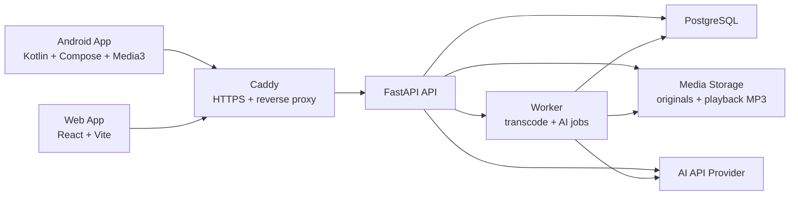

# Easy Music Architecture

## 1. Overview

Easy Music is a self-hosted personal cloud music system.

The first version contains:

- FastAPI backend
- React/Vite web app
- Android app built with Kotlin, Jetpack Compose, and Media3
- PostgreSQL database
- FFmpeg-based media processing
- Worker for background jobs
- Local disk media storage
- Caddy reverse proxy and HTTPS
- Docker Compose deployment

## 2. High-Level Architecture

This document describes the current MVP architecture after the accepted
Phase 7 Deployment Hardening work. Backend, Web, Android, recommendation,
AI assistant, and deployment artifacts are now implemented in their
corresponding top-level directories.

## 3. Repository Structure

Top-level structure:

- `backend/`: FastAPI backend service, Alembic migrations, backend tests, media-processing integration, and worker entry points.
- `web/`: React/Vite web management console source, static assets, and frontend build configuration.
- `android/`: Kotlin, Jetpack Compose, and Media3 Android app source, Android tests, and Android build configuration.
- `deploy/`: production reverse proxy configuration, host setup script, database backup script, and deployment support material.
- `docs/`: product, architecture, development, environment, deployment, and task documentation.

### 3.1 Backend Module Boundaries

The backend keeps these modules separated at a high level:

- Auth: authentication, token/session handling, password hashing, and access control.
- Users: user records, ownership boundaries, and single-user-to-future-multi-user compatibility.
- Tracks: library metadata, playback file references, status, and track updates.
- Playlists: owner-scoped manually curated playlists and ordered playlist-track
  membership for future recommendation signals.
- Tags: tag taxonomy, tag groups, and track-tag assignment.
- Uploads: audio upload validation, original file persistence, and upload lifecycle state.
- Video uploads: user-provided video validation, temporary media storage, and
  creation of video extraction processing jobs.
- Imports: optional administrator-configured local import roots, path safety
  checks, read-only scan preview, explicit confirmed import, and small batch
  history for Web status display.
- Media processing: metadata extraction, playback MP3 generation, cover extraction, and FFmpeg integration.
- Playback events: online/offline playback event ingestion and duplicate-safe sync.
- Feedback events: recommendation feedback ingestion and cooldown/avoidance inputs.
- Recommendation: structured rule-based ranking and result explanation.
- AI assistant: provider abstraction, intent parsing, recommendation composition, and tag suggestions.
- Worker: background job execution for media processing.

## 4. Deployment

Target environment:

- Ubuntu physical machine
- Public IP
- Domain name
- 4 TB disk
- Docker Compose

Recommended services:

- `caddy`: HTTPS reverse proxy
- `api`: FastAPI backend
- `worker`: background processing
- `web`: built React web app served by Caddy or a static container
- `postgres`: PostgreSQL database

Recommended mounted paths:

- `/srv/easy-music/media/originals`
- `/srv/easy-music/media/playback`
- `/srv/easy-music/media/covers`
- `/srv/easy-music/media/temp-videos`
- `/srv/easy-music/postgres`

## 5. Backend

### 5.1 Technology

- Python 3.12
- FastAPI
- SQLAlchemy
- Alembic migrations
- PostgreSQL
- FFmpeg
- AI provider abstraction

### 5.2 Core Backend Modules

- Auth
- Users
- Tracks
- Uploads
- Media processing
- Tags
- Playback sessions
- Feedback events
- Recommendation
- AI assistant
- Android cache sync

Playback queue state is client-local. The backend persists playlists and their
ordered tracks, but it does not persist current playback queues or synchronize
queue state across devices.

## 6. Android App

### 6.1 Technology

- Kotlin
- Jetpack Compose
- Android Media3
- Room for local cache metadata
- WorkManager for background sync
- DataStore for settings and auth token

### 6.2 Responsibilities

- Login
- Recommendation home
- Cloud playback
- Playlist browsing and playback handoff
- Local playback queue management with history/current/upcoming, playlist
  sequence/shuffle/reverse generation, upcoming reorder, and playlist-only
  repeat
- Background playback
- Notification and lock screen controls
- Headset control integration
- Manual track cache
- Offline playback for cached tracks
- Playback and feedback sync

### 6.3 Local Data

Android should store:

- Auth session
- Cached track metadata
- Cached audio files
- Unsynced playback events
- Unsynced feedback events

## 7. Web App

### 7.1 Technology

- React
- TypeScript
- Vite

### 7.2 Responsibilities

- Login
- Audio upload
- Library management
- Playlist management
- Track editing
- Tag management
- AI tag confirmation
- Recommendation testing
- Web playback
- Client-side playback queue with history/current/upcoming, queue editing,
  playlist sequence/shuffle/reverse generation, upcoming reorder, and
  playlist-only repeat
- Playback history

## 8. Data Model Draft

### 8.1 User

- `id`
- `username`
- `password_hash`
- `created_at`

Version 1 is single-user, but tables should still include `user_id`.

### 8.2 Track

- `id`
- `user_id`
- `title`
- `artist`
- `album`
- `duration_seconds`
- `content_type`
- `original_file_path`
- `original_file_size_bytes`
- `original_file_sha256`
- `playback_file_path`
- `playback_file_sha256`
- `cover_path`
- `source_url`
- `format`
- `bitrate`
- `normalized_metadata_key`
- `status`
- `liked`
- `cooldown_until`
- `created_at`
- `updated_at`

Possible statuses:

- uploading
- processing
- ready
- failed

### 8.3 Tag

- `id`
- `user_id`
- `name`
- `group`
- `created_at`

Possible groups:

- scenario
- state
- type
- attribute

### 8.4 TrackTag

- `track_id`
- `tag_id`
- `confidence`
- `source`

Possible sources:

- user
- ai
- system

### 8.5 PlaybackEvent

- `id`
- `user_id`
- `track_id`
- `client`
- `event_type`
- `position_seconds`
- `duration_seconds`
- `occurred_at`

Possible event types:

- play
- pause
- resume
- skip
- complete
- seek

### 8.6 FeedbackEvent

- `id`
- `user_id`
- `track_id`
- `scenario_context`
- `state_context`
- `type_context`
- `feedback_type`
- `occurred_at`

Possible feedback types:

- like
- tired
- not_today
- not_suitable_for_context
- skip_recommendation

### 8.7 RecommendationRequest

- `id`
- `user_id`
- `raw_text`
- `parsed_context_json`
- `created_at`

### 8.8 RecommendationResult

- `id`
- `request_id`
- `track_id`
- `rank`
- `score`
- `reason`

### 8.9 ImportBatch

- `id`
- `user_id`
- `root_id`
- `status`
- `message`
- `requested_count`
- `imported_count`
- `skipped_count`
- `failed_count`
- `created_at`
- `updated_at`

### 8.10 ImportItem

- `id`
- `batch_id`
- `user_id`
- `root_id`
- `relative_source_path`
- `display_name`
- `status`
- `track_id`
- `error_message`
- `created_at`
- `updated_at`

### 8.11 ProcessingJob

- `id`
- `track_id`
- `status`
- `job_type`
- `source_path`
- `error_message`
- `started_at`
- `finished_at`
- `created_at`
- `updated_at`

### 8.12 Playlist

- `id`
- `user_id`
- `name`
- `created_at`
- `updated_at`

Playlists are ordinary user-created private lists. Version 2.1 does not include
smart playlists, public sharing, collaboration, or automatic playlist
generation.

### 8.13 PlaylistTrack

- `playlist_id`
- `track_id`
- `position`
- `created_at`

`playlist_tracks` is scoped through its parent playlist owner and only accepts
tracks owned by the same user. The service also exposes a narrow read-only
playlist signal method for future recommendation work, but Recommendation V1
ranking does not consume playlist signals yet.

## 9. Media Processing

### 9.1 Upload

Supported upload formats:

- MP3
- FLAC
- M4A
- WAV
- OGG
- AAC

Supported user-provided video upload formats:

- MP4
- MKV
- MOV
- WEBM

### 9.2 Processing Pipeline

1. Save original file.
2. Store advisory duplicate signals for the original, including file size and
   SHA-256 hash when the saved file is readable.
3. Extract metadata.
4. Generate normalized MP3 playback file.
5. Store a normalized metadata key and playback SHA-256 hash when available.
6. Extract or generate cover if available.
7. Create or update Track.
8. Ask AI for tag suggestions.
9. Mark track as ready or failed.

V1.1 also allows the owner to replace a track cover image from the Web Track
Detail page. Replacement covers are stored under the configured cover media
directory and update only `tracks.cover_path`; they do not regenerate playback
audio or modify the preserved original audio file.

### 9.3 Playback Format

Version 1 uses MP3 playback files for compatibility.

Original files are preserved for future reprocessing.

### 9.4 Duplicate Signals

V1.1 stores duplicate-detection signals on each track for later advisory
duplicate review. The signals are scoped through the existing `tracks.user_id`
ownership boundary and include original file size, original file SHA-256,
normalized metadata key, and playback file SHA-256 when processing has produced
a playback file. These values do not include local filesystem paths, secrets, or
media contents.

Duplicate detection remains advisory. Signal storage must not block uploads and
must not delete, merge, overwrite, or hide tracks automatically.

### 9.5 Import Root Safety

V2 import tools are disabled when `IMPORT_ALLOWED_ROOTS` is empty. When enabled,
the backend treats configured roots as an allowlist of server-side directories.
Requested paths are relative to one configured root, resolved before use, and
rejected if they escape the root or target broad locations such as a drive root,
OS root, user home directory, repository root, or `MEDIA_ROOT`.

The import API surface is intentionally small:

- `GET /api/imports/configuration` returns enabled state and safe root labels.
- `POST /api/imports/scan` scans one configured root/subdirectory for supported
  audio candidates and skipped files.
- `POST /api/imports` imports only explicitly selected audio files by copying
  them into controlled original media storage, creating normal tracks and normal
  pending processing jobs.
- `GET /api/imports/batches/latest` and `GET /api/imports/batches/{batch_id}`
  return the current user's safe import batch history for Web status display.

Scan preview responses include safe relative paths, basenames, extensions,
sizes, support status, skipped reasons, and applied scan limits. They do not
expose unrestricted absolute paths, run FFmpeg/ffprobe, create tracks, create
processing jobs, hash files, copy files, delete files, move files, or modify
source directories.

Confirmed import responses and batch history store only safe source display
data: configured root id, relative source path, basename, per-file status,
resulting track id, UI-safe error message, and timestamps. They do not expose
absolute import source paths. Imported item track details are built from the
existing safe track response, and track processing status remains the source of
truth for transcoding results.

### 9.6 Temporary Video Uploads

`POST /api/tracks/upload-video` accepts explicit user-provided video files for
later audio extraction. The request validates extension, content type, upload
size, and a basic file signature, then stores the video under
`MEDIA_ROOT/TEMP_VIDEOS_DIR` using media storage helpers.

Video uploads create a normal `Track` with `processing` status and a pending
`ProcessingJob` with `job_type="video_extraction"` and a safe relative
`source_path` to the temporary video. The track response does not expose the
temporary path, and the video is not stored as `tracks.original_file_path`,
playback media, or cover media. Worker extraction is handled separately by the
V2 worker task; until then, the existing audio worker only claims
`audio_processing` jobs and leaves video extraction jobs pending.

## 10. Recommendation System

Version 1 uses hybrid recommendation:

> LLM intent parsing + rule-based ranking + feedback adjustment.

### 10.1 LLM Responsibilities

- Parse natural language into structured context
- Suggest tags for new tracks
- Generate short recommendation reasons
- Suggest library organization improvements

### 10.2 Rule Ranking Inputs

- Scenario tag match
- State tag match
- Type tag match
- Attribute filters
- Like status
- Recent playback
- Cooldown
- Not-today feedback
- Skip frequency
- Not-suitable feedback for current context
- Cached status on Android, if relevant

### 10.3 Recommendation Output

The API should return:

- One primary recommendation
- Two alternatives
- Reason for each result
- Structured explanation details for each result, including matched tags,
  boosts, penalties, feedback impact, and avoidance reasons.
- Top-level exclusions considered, such as active cooldown or same-day
  `not_today` feedback filters.

The structured explanation is derived from the same rule-based ranking inputs
as the score and concise `reason` text. It does not change ranking order and
does not let AI select tracks.

## 11. API Draft

### Auth

- `POST /api/auth/login`
- `POST /api/auth/logout`
- `GET /api/auth/me`

### Tracks

- `GET /api/tracks`
- `POST /api/tracks/upload`
- `POST /api/tracks/upload-video`
- `GET /api/tracks/{id}`
- `PATCH /api/tracks/{id}`
- `PUT /api/tracks/{id}/cover`
- `GET /api/tracks/{id}/cover`
- `DELETE /api/tracks/{id}`
- `GET /api/tracks/duplicates`
- `GET /api/tracks/{id}/stream`
- `GET /api/tracks/{id}/download-cache`

### Playlists

- `GET /api/playlists`
- `POST /api/playlists`
- `GET /api/playlists/{id}`
- `PATCH /api/playlists/{id}`
- `DELETE /api/playlists/{id}`
- `POST /api/playlists/{id}/tracks`
- `DELETE /api/playlists/{id}/tracks/{track_id}`
- `PUT /api/playlists/{id}/tracks/order`

### Tags

- `GET /api/tags`
- `POST /api/tags`
- `PATCH /api/tags/{id}`
- `DELETE /api/tags/{id}`

### Imports

- `GET /api/imports/configuration`
- `POST /api/imports/scan`
- `POST /api/imports`
- `GET /api/imports/batches/latest`
- `GET /api/imports/batches/{batch_id}`

### Playback And Feedback

- `POST /api/playback-events`
- `POST /api/feedback-events`
- `POST /api/sync/events`

### Recommendation

- `POST /api/recommendations`
- `GET /api/recommendations/revived`

### AI

- `POST /api/ai/parse-listening-intent`
- `POST /api/ai/recommend`
- `POST /api/ai/tracks/{track_id}/suggest-tags`

## 12. Security

Version 1 is single-user but public-facing.

Minimum requirements:

- Login required for all app routes and APIs
- Hashed passwords
- HTTPS through Caddy
- Upload size limits
- File type validation
- Path traversal protection
- API rate limits for AI endpoints
- Configured secret keys through environment variables

## 13. Future Architecture Hooks

Reserve fields and modules for:

- Multi-user support
- Audio feature analysis
- BPM detection
- Vocal detection
- Language detection
- Embedding-based recommendation
- Android packaged web features, if useful
- Windows desktop client, if needed later
